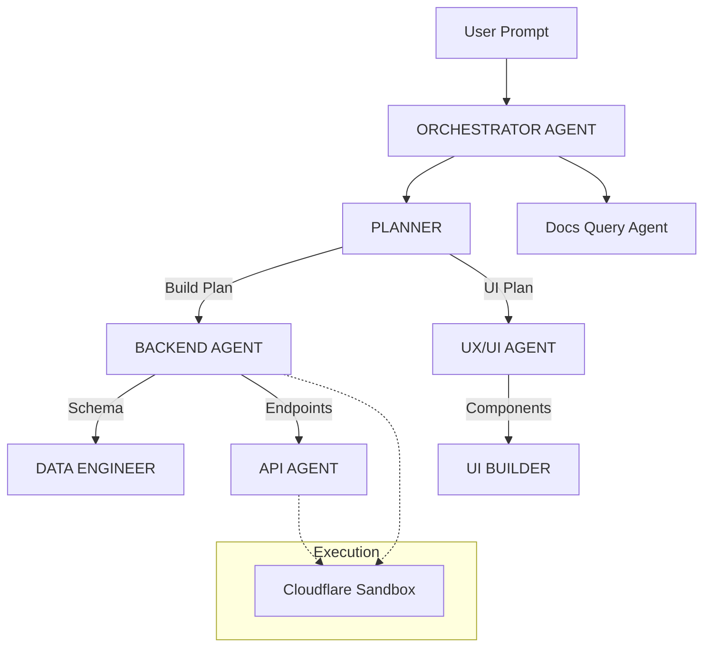

# AGENTS.md - CloudForge Repository

## Project Overview

CloudForge is an AI-powered, agentic service that accepts natural language prompts to automatically plan, build, and deploy Cloudflare Workers. The system uses a coordinated team of AI agents powered by Cloudflare Workers AI, orchestrated through the Cloudflare Agents SDK, with secure code execution in Cloudflare Sandbox SDK containers.

The project is built as a full-stack monorepo optimized for Cloudflare Workers deployment, utilizing Bun as the primary runtime and package manager.

## Repository Structure

```text
cloudforge/
├── AGENTS.md                     # This file - root agent guidance
├── apps/
│   ├── web/                      # Marketing static website (Vite + React)
│   ├── app/                      # Main application SPA (React 19 + TanStack Router)
│   │   ├── AGENTS.md             # Frontend-specific agent guidance
│   │   └── src/                  # Frontend source (Hooks, Components, Pages)
│   ├── api/                      # Backend Worker (Hono + Agents SDK + tRPC)
│   │   ├── AGENTS.md             # API-specific agent guidance
│   │   ├── src/
│   │   │   ├── agents/           # Agent class definitions (Planner, Coder, etc.)
│   │   │   ├── mcp/              # MCP server implementation
│   │   │   └── routes/           # Hono REST & tRPC routes
│   │   └── wrangler.jsonc        # Cloudflare Worker config
│   └── email/                    # React Email templates for authentication/notifications
├── packages/
│   ├── core/                     # Shared core utilities and WebSocket functionality
│   ├── ui/                       # Shared UI components and shadcn/ui management
│   ├── db/                       # Drizzle ORM schemas, migrations, and seeds
│   └── config/                   # Shared TSConfig, ESLint, Tailwind configs
├── infra/                        # Terraform infrastructure configuration
├── docs/                         # VitePress documentation site
└── scripts/                      # Build and utility scripts

```

## Technology Stack

### Core Technologies

| Technology | Purpose | Documentation |
| --- | --- | --- |
| **Bun** | Runtime & Package Manager | https://bun.sh/ |
| **Cloudflare Workers** | Serverless compute | https://developers.cloudflare.com/workers/ |
| **Cloudflare Agents SDK** | Multi-agent orchestration | https://developers.cloudflare.com/agents/ |
| **Cloudflare Sandbox SDK** | Secure code execution | https://developers.cloudflare.com/sandbox/ |
| **Hono** | Web framework (Backend) | https://hono.dev/ |
| **React 19** | Frontend framework | https://react.dev/ |
| **TanStack Router** | Frontend Routing | https://tanstack.com/router/ |
| **Drizzle ORM** | Database ORM (with D1) | https://orm.drizzle.team/ |
| **shadcn/ui** | UI components | https://ui.shadcn.com/ |
| **Workers AI** | LLM inference | https://developers.cloudflare.com/workers-ai/ |

### Key Patterns

* **Monorepo**: Turborepo with Bun workspaces.
* **API Design**: tRPC for app communication, REST/OpenAPI for external access.
* **Database**: Drizzle ORM with D1 (No raw SQL).
* **State Management**: Durable Objects (Agent state) & Jotai (Frontend state).
* **Realtime**: WebSocket subscriptions for progress updates.

## Agent Architecture

CloudForge uses a multi-agent system where each agent has specific responsibilities:



## Essential Commands (Bun)

Agents and developers should use `bun` for all lifecycle scripts.

```bash
# Development
bun dev                       # Start web app dev server
bun web:dev                   # Start marketing site
bun api:dev                   # Start API server (Agent backend)
bun app:dev                   # Start main app dashboard

# Building
bun build                     # Build all apps
bun web:build                 # Build marketing site
bun app:build                 # Build main app
bun email:build               # Build email templates
bun --filter @repo/api build  # Build API types

# Testing
bun test                      # Run all tests
bun app:test                  # Test main app
bun api:test                  # Test API

# UI Components (shadcn/ui)
bun ui:add <component>        # Add shadcn/ui component
bun ui:list                   # List installed components
bun ui:update                 # Update all components

# Database Management
bun --filter @repo/db generate # Generate migrations
bun --filter @repo/db push     # Apply DB schema changes to D1
bun --filter @repo/db studio   # Open DB GUI
bun --filter @repo/db seed     # Seed sample data

# Deployment
bun web:deploy                # Deploy marketing site
bun api:deploy                # Deploy API server
bun app:deploy                # Deploy main React app

```

## Critical Rules for All Agents

### 1. Code Conventions

* **Functional Programming:** Favor functional patterns (hooks, pure functions) over classes.
* **Modern TypeScript:** Use `const assertions`, template literals. Avoid `any`.
* **Imports:** Use named imports (`import { foo } from "bar"`) to support tree-shaking.
* **Bun/Hono Idioms:** Use native Bun APIs where possible. Use Hono middleware for logic.

### 2. Database Access

```typescript
// ✅ ALWAYS use Drizzle ORM
import { drizzle } from 'drizzle-orm/d1';
import * as schema from '@cloudforge/db/schema';

const db = drizzle(env.DB, { schema });
const users = await db.select().from(schema.users);

// ❌ NEVER use raw SQL in application code
// const result = await env.DB.prepare('SELECT * FROM users').all(); 

```

### 3. API Design & Validation

```typescript
// ✅ ALWAYS include operationId and Zod schemas
const route = createRoute({
  method: 'post',
  path: '/requests',
  operationId: 'createRequest', // REQUIRED for Client SDK generation
  tags: ['Requests'],
  request: {
    body: {
        content: {
            'application/json': { schema: CreateRequestSchema }
        }
    }
  },
  responses: { ... }
});

```

### 4. Sandbox SDK Usage

```typescript
// ✅ Version must match npm package
// FROM docker.io/cloudflare/sandbox:0.3.3

// ✅ Use consistent sandbox IDs per request
const sandbox = getSandbox(env.Sandbox, `backend-${requestId}`);

```

### 5. Agent Communication

```typescript
// ✅ Use Durable Object fetch for inter-agent communication
const plannerId = env.PLANNER.idFromName(requestId);
const planner = env.PLANNER.get(plannerId);
await planner.fetch(new Request('http://internal/create-plan', {
  method: 'POST',
  body: JSON.stringify({ requestId, prompt }),
}));

```

## Environment Variables

### Required

```bash
# Cloudflare Authentication
CLOUDFLARE_API_TOKEN=           # Token with Workers, D1, R2, KV permissions
CLOUDFLARE_ACCOUNT_ID=          # Your Cloudflare account ID

# GitHub Integration
GITHUB_TOKEN=                   # PAT with repo permissions
GITHUB_ORG=                     # Target GitHub organization

# Database
CLOUDFLARE_D1_DATABASE_ID=      # D1 ID for Drizzle operations

```

## Cloudflare Documentation Queries

Agents should query Cloudflare documentation via MCP when uncertain about implementation details.

```typescript
// Load docs context via MCP
await agent.addMcpServer('cloudflare-docs', '[https://developers.cloudflare.com/mcp](https://developers.cloudflare.com/mcp)');
const docsContext = await agent.callMcpTool('cloudflare-docs', 'search', { 
    query: 'Workers AI text generation binding configuration' 
});

```

## Error Handling

1. **API Errors:** Return consistent JSON with error codes.
2. **Agent Errors:** Log to `agentActivityLog` table and broadcast via WebSocket.
3. **Sandbox Errors:** Catch execution errors, retrieve logs (`cat /var/log/build.log`), and save to task history before cleanup.

## Contributing

1. Update `AGENTS.md` or sub-project `AGENTS.md` when architectural changes occur.
2. Add OpenAPI documentation for new endpoints.
3. Use `bun lint` to verify code quality before committing.


```
